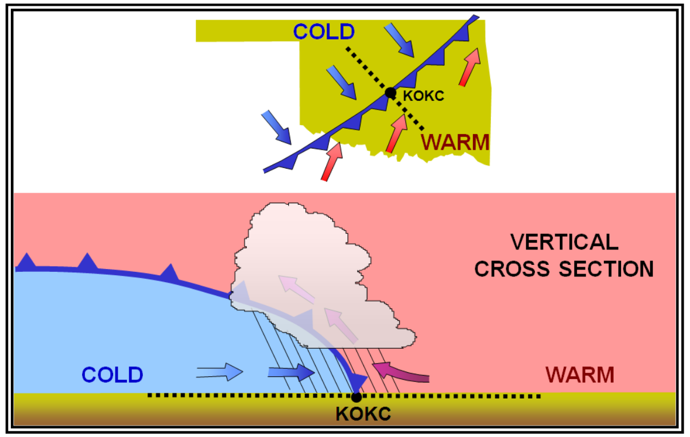

# Phase 2 — Diagram Replacement Strategy

**Reference:** `AUDIT_2026-05-07.md` §1 and `DIAGRAM_INVENTORY.md` (full per-diagram table).
**Status:** Recommendation only. No code changes yet — implementation pending your approval.
**Date:** 2026-05-07

> **Chapter references corrected** — see `PHASE_2B_PICKS.md` for canonical FAA figure locations (Ch 9 jets, Ch 10 wind, Ch 11 fronts, Ch 19 turbulence, Ch 25 charts).

---

## Q1. Inventory

The full table — diagram name, concept, accuracy verdict, FAA-equivalent availability, and replace-or-keep call — already lives in [DIAGRAM_INVENTORY.md](DIAGRAM_INVENTORY.md), which was committed and pushed in Phase 1. Quick tally from that table:

- **30 hand-coded SVG / interactive diagrams** in `js/diagrams.js`
- **8 PROCESS_DIAGRAMS** already FAA-image-backed (frontal_lifting × 3, thunderstorm_lifecycle × 2, density_altitude × 2, orographic_effect × 3, temperature_inversion × 2, icing_accretion × 3, metar_syntax, taf_change_groups)
- Verdicts on the 30 SVGs: 13 ✅ accurate · 7 ⚠️ misleading · 1 ❌ wrong · 9 🤷 stylized-only

---

## Q2. Replace-vs-keep — keepers list (expanded)

The audit's 6 keepers stand. Three additional SVGs earn their keep that the audit didn't surface explicitly:

| Diagram | Reason it earns its keep |
|---|---|
| `densityAltCalc` | Live PA + OAT slider; real-time DA output. No static FAA chart competes. |
| `waveCycloneSVG` (5-stage tabbed) | Animated stage progression with correct front symbology. FAA shows snapshots; this teaches the time evolution. |
| `microburstApproach` (4-phase) | Phase walk through the headwind-trap → downdraft → tailwind sequence; the airspeed-increase paradox emerges from the animation in a way no static figure can match. |
| `icingSeverityCalc` / `fogFormationCalc` / `renderFlightCategoryCalc` | Three calculators with no FAA equivalent. Pure pedagogical wins. |
| METAR / TAF / PIREP decoders + `renderDecodePractice` | Tap-to-decode token interactions. Far better than reading FAA Fig 24-1 callouts. |
| `lapseRateGraph` (interactive ELR slider) | Physics correct, no FAA interactive equivalent. |
| **`altimeterErrorSVG`** + scenarios | Slider-driven scenario set ("From High to Low"). FAA has no equivalent visualization that lets a student feel the magnitude of the error change. |
| **`frontsSVG`** (4-front symbology with tap-to-learn) | Symbology drawn correctly (cold/warm/stationary/occluded). The interactive "tap each symbol" model teaches the symbology faster than reading a static legend. |
| **`stabilitySlider`** (side-by-side stable vs unstable) | No layout equivalent in FAA. Useful comparison framing for ELR vs DALR/MALR intuition. Bottom-line legend is correct. |
| **`renderWeatherCodeBuilder`** | Interactive composition of present-weather codes (intensity + descriptor + phenomenon). No FAA equivalent. |

**Total keepers: ~14 SVGs / interactive components** (counting each calculator and decoder as one).

The unifying criterion across keepers: animation, interactivity, sequential reveal, or live computation is doing real teaching work that a single static FAA raster cannot replicate.

---

## Q3. Wrong-and-no-FAA-equivalent — recovery per case

Most factually problematic SVGs have a directly-corresponding FAA figure (see DIAGRAM_INVENTORY.md). The honest gap list is short:

| SVG | Issue | No FAA equivalent? | Recommendation |
|---|---|---|---|
| **`renderAdvisoryHierarchy`** | Pyramid metaphor implies strict priority ranking, but Convective SIGMET / SIGMET / AIRMET / CWA have *different domains*, not a single severity ladder. CWA at the bottom mis-suggests low priority when CWAs can be highly time-critical. | Correct — FAA discusses these advisories textually but has no canonical pyramid figure. | **Redraw** as four parallel cards, each with a "what it covers" / "who should care" / "validity period" / "issuance authority" mini-table. Optionally: a Venn-style domain diagram showing the convective / icing / IFR / turbulence overlaps. The text in `showAdvisory` is already accurate; only the metaphor needs fixing. |

Everything else either (a) has an FAA figure already in `img/awh/`, or (b) is a keeper. No SVGs need to be cut from the curriculum entirely.

---

## Q4. Layout, sizing, consistency

### Existing PROCESS_DIAGRAMS pattern (template)

```html
<div style="background:#111827">
  
  <div style="padding:5px 14px 6px;font-size:11px;font-weight:700;color:#38BDF8;
              font-family:var(--font-display);border-top:1px solid #1e3a5f">
    ▶ Plan view (top): cold air (blue arrows) advancing rapidly. Cross-section
    (bottom): steep slope, narrow intense weather band
  </div>
</div>
```

This is solid for stepped/process diagrams (one figure per stage with a teaching pointer below). The pattern handles mobile responsiveness already (`width:100%; object-fit:contain`).

### Recommended evolution for general FAA-image swap

Introduce a single helper, `renderFaaFigure({ src, figureNumber, title, caption })`, that all FAA-image swaps route through. Returns a self-contained block:

```
┌────────────────────────────────────────────────┐
│ [navy bar]     FAA-H-8083-28A · Fig 11-6       │  ← figure tag (mono, sky blue)
├────────────────────────────────────────────────┤
│                                                │
│        [FAA image, max-height ~320px]          │
│                                                │
├────────────────────────────────────────────────┤
│ ▶ Cold air undercuts warm air; steep slope =   │  ← teaching pointer (display, sky)
│   narrow intense weather band                  │
└────────────────────────────────────────────────┘
```

Container guidance:
- **`max-width: 100%`**, `display:block`. Already responsive — no fixed pixel widths.
- **`max-height` 320px** (similar to current 310px) so tall portrait figures don't dominate the lesson; `object-fit: contain` preserves aspect ratio.
- **Caption max two lines** at typical mobile widths. Long pedagogical text belongs in the surrounding lesson body, not the caption.
- **Dark navy background** (`var(--navy)` or `#111827`) frames PNGs that have white backgrounds, preventing visual bleed into the surrounding light page.

### Mobile responsiveness

The single existing `@media (min-width:768px)` breakpoint plus `body{overflow-x:hidden}` is fine for the diagrams themselves once they use `width:100%` + `object-fit:contain`. The audit's separate flag about thin breakpoints is a layout-elsewhere problem, not a diagram-rendering problem — the figures will not break on narrow screens.

### Consolidation: helpers vs. per-diagram functions

Recommendation: **one helper for FAA-image swaps; SVG keepers stay as their own functions in `Diagrams`.**

- `renderFaaFigure({...})` = unified wrapper for every PNG swap. Replaces both inline `` blocks and the current PROCESS_DIAGRAMS template literal patchwork.
- `Diagrams.cbIngredients()`, `Diagrams.densityAltCalc()`, the decoders, the calculators — keep as their own renderer functions because they generate non-trivial markup with state, listeners, and per-diagram interactions that don't fit a generic wrapper.
- The dispatcher (`Diagrams.render(type, key)`) keeps its current type-switching shape; just the FAA-image-backed branches all funnel through `renderFaaFigure`.

Net change is small (a single helper, ~25 lines), but it makes the diff for every subsequent FAA swap a one-line change at the call site rather than 80+ characters of inline `<div>...<div>` HTML.

---

## Q5. Image attribution

**Yes — display FAA figure numbers visibly on every FAA-image swap.** Reasons:

1. Reinforces the "official source" signal to students.
2. Lets students cross-reference the printed handbook (or the AWH PDF) to read the surrounding chapter for fuller context.
3. Honest provenance — it's clear at a glance which diagrams come from FAA and which are app-built.

Recommended format:

- **Tag location:** small navy strip at the top of each FAA figure block (above the image).
- **Format:** `FAA-H-8083-28A · Fig 11-6` (handbook ID · figure number, separated by a middle dot).
- **Style:** `font-family: var(--font-mono); font-size: 11px; color: var(--sky); padding: 6px 14px;`
- **Alt text:** include the same string in the `alt=""` for screen-reader users.

For SVG keepers (custom diagrams), no FAA tag — instead they keep their existing diagram-header titles ("🔍 Wind Forces — Tap to Explore", etc.) which already signal "this is an app-built explanation, not an FAA figure."

---

## Q6. Execution order

The audit's top 5 was a strong list. Confirming with one re-ordering and three additions:

| # | Diagram | Verdict | Reason it goes here |
|---|---|---|---|
| **1** | `coldFrontCrossSectionSVG` | ❌ **wrong** (only one in the file) | Cold-air polygon inverted relative to FAA Fig 11-6. The single factual physics error in the diagram set — fix first. **And it's a freebie:** the SVG is registered as `cold_front_cross` in the hotspot dispatcher but no section's `diagram:` config calls it (m5/s5_2 already routes through PROCESS_DIAGRAMS' `frontal_lifting`). **Pure delete, no replacement work.** |
| **2** | `mountainWave` | ⚠️ misleading (rotor placement, lenticular geometry) | Same freebie pattern: registered in the interactive dispatcher but no section calls it. PROCESS_DIAGRAMS' `orographic_effect_03` already wires FAA Fig 16-14. **Pure delete.** |
| **3** | `cloudGallerySVG` | 🤷 stylized to the point of breaking ID training | Cb has no anvil; Cu/Sc/Ac thumbnails are visually indistinguishable. Cloud ID is a checkride topic. Replace with FAA Ch 9 cloud photo plates. |
| **4** | `jetStreamSVG` | ⚠️ CAT placement contradicts the (correct) text | Visual-vs-text contradiction is corrosive — students absorb the visual. Replace with FAA Ch 17 jet-stream/CAT diagram. |
| **5** | `turbulenceSources` | ⚠️ vertical-column composition fails | Mountain doesn't reach the CAT layer; CB doesn't either; "inversion" is a free-floating dashed line. Replace with FAA Ch 17 turbulence-types schematic. |
| **6** | `cbLifecycle` (3-stage interactive) | ⚠️ mature-stage anvil disconnected from cloud body | Same freebie: registered in dispatcher (`cb_lifecycle`) but no section calls it; PROCESS_DIAGRAMS already provides `thunderstorm_lifecycle_02`. **Pure delete.** |
| **7** | `pressureSystemsSVG` | 🤷 H/L/Ridge/Trough cards with no isobars or rotation | Surface analysis chart reading is a checkride-level skill. Replace with FAA Ch 7 isobar/H-L diagrams. Worth pairing with `windForcesSVG` because they're conceptually adjacent. |
| **8** | `windForcesSVG` | ⚠️ PGF / Coriolis geometry fails to communicate steady-state balance | Foundational concept (Buys-Ballot, geostrophic flow) — getting the visual right matters. Replace with FAA Ch 7 PGF/Coriolis diagram, or redraw with explicit "PGF magnitude = Coriolis magnitude" annotations. |
| **9** | `inversionTypesSVG` | 🤷 cards with no sounding curves | Sounding-curve reading appears on PPL written and instrument oral exams. Replace with FAA Ch 5 Fig 5-9 (already used in PROCESS_DIAGRAMS for `temperature_inversion_01`) — possibly extend that PROCESS_DIAGRAMS entry rather than swapping in `s4_3` or wherever inversionTypesSVG renders today. |
| **10** | `renderAdvisoryHierarchy` | ⚠️ pyramid metaphor misleading | **Redraw as four parallel domain cards** (no FAA equivalent to swap in). Lower priority than the 9 above because the descriptive text is correct; only the metaphor needs replacing. |

**Lower-priority replace candidates** (text accurate, visuals just stylized): `iceTypes`, `fogTypes`, `cbIngredients`, `atmosphereSVG` (scale callout would be enough), `inversionTypesSVG` (already on the list above). These should follow #1–#10.

### Phase 2 implementation suggestion

Three sub-passes, smallest first:

**Pass 2a — Freebie deletes** (no replacement work, just code removal):
- `coldFrontCrossSectionSVG`, `cbLifecycle` (interactive), `mountainWave` (interactive). Three dead-code paths, ~150 lines removed from `diagrams.js`. Ship as one PR.

**Pass 2b — High-impact swaps** (5 swaps, real teaching impact):
- `cloudGallerySVG`, `jetStreamSVG`, `turbulenceSources`, `pressureSystemsSVG`, `windForcesSVG`. Build the `renderFaaFigure` helper here as the first deliverable, then use it for these five. Ship as one PR.

**Pass 2c — Cleanup** (lower priority, polish):
- `inversionTypesSVG`, `renderAdvisoryHierarchy` (redraw), the 4 remaining stylized cards (`iceTypes`, `fogTypes`, `cbIngredients`, `atmosphereSVG` scale callout). Ship as one PR.

Total: ~10 diagrams replaced + 3 deletes + 1 redraw + 1 scale-callout, across three reviewable PRs.

---

## Open questions / decisions before implementation

1. **`renderAdvisoryHierarchy` redesign direction:** four parallel cards (simplest, ships fastest) vs. Venn-style domain diagram (richer but new visual idiom). Recommend cards.
2. **FAA figure-number tag styling:** confirm `font-mono · sky-blue · navy strip` is the right look, or you want it more subtle (e.g., bottom-right corner of caption rather than top strip).
3. **`atmosphereSVG`:** strict-scale rebuild (educational, but loses the layer-tap interactivity), versus keep current diagram with an added "not to scale" annotation. Recommend the latter — scale is a known compromise on every atmospheric-layers schematic, and the interactive layer-tap is a teaching win.
4. **Image inventory selection:** for each swap, I'll need to commit to specific FAA page numbers from `C:\FAA Images\aviation weather handbook images\images_png\`. The JSON metadata at `json/awh_full_extraction.json` plus the contact sheets in `review/` should be enough to map concept → page → figure number, but I'll surface the picks for your sign-off before any swap lands.

Stopping here per Prompt B. Ready to start Pass 2a (the freebie deletes) on your word.
